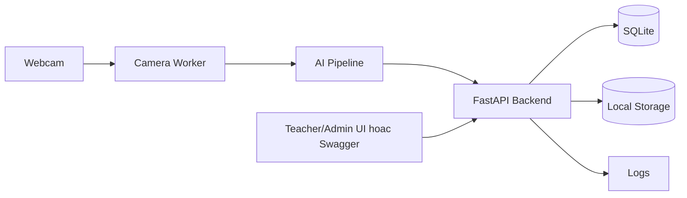

# Face Attendance MVP

MVP cho he thong nhan dien khuon mat va diem danh tu dong. Thiet ke uu tien chay local tren Windows, CPU, de debug cho junior.

## Kien Truc



Trong MVP, chi backend duoc ghi ban ghi diem danh chinh thuc. Camera worker va AI pipeline chi gui su kien nhan dien ung vien.

## Cai Dat Tren Windows

```powershell
python -m venv .venv
.\.venv\Scripts\activate
pip install -r requirements.txt
pip install -r requirements-camera.txt
copy .env.example .env
python scripts/init_db.py
python scripts/seed_demo.py
uvicorn backend.app.main:app --reload
```

Mo Swagger UI tai:

```text
http://127.0.0.1:8000/docs
```

Mo giao dien demo camera tai:

```text
http://127.0.0.1:8000/demo
```

Chay camera worker:

```powershell
pip install -r requirements-camera.txt
python camera_worker/main.py --camera 0 --api http://127.0.0.1:8000 --session-id 1 --class-id 1
```

Neu ban dang dung Python cua MSYS va pip phai build `pydantic-core` hoac OpenCV tu source, hay cai Python chinh thuc tu python.org roi tao lai `.venv`. Backend va test nghiep vu khong phu thuoc OpenCV; OpenCV chi can khi chay camera/AI.

## Test Demo Camera

```powershell
pip install -r requirements-camera.txt
uvicorn backend.app.main:app --reload
```

Sau do mo:

```text
http://127.0.0.1:8000/demo
```

Luot test nhanh:

1. Bam `Bat camera`.
2. Chon sinh vien, dua mat vao camera, bam `Dang ky anh`.
3. Chon ca hoc sang 07:00 hoac chieu 13:00.
4. Sua `Gio vao hoc` va `Cho phep tre` neu can.
5. Bam `Mo buoi`.
6. Bam `Bat dau quet`.

Bang diem danh hien ma sinh vien, ho ten, lop, thoi gian diem danh, trang thai va canh bao dung gio/tre theo cau hinh cua buoi.

## Chay App Desktop

Mo terminal 1 de chay backend:

```powershell
.\.venv-win\Scripts\activate
python scripts\init_db.py
python scripts\seed_demo.py
uvicorn backend.app.main:app --reload
```

Mo terminal 2 de chay app:

```powershell
.\.venv-win\Scripts\activate
python desktop_app\main.py
```

Tai khoan demo:

```text
admin / admin123
device01 / device123
```

Luong admin:

1. Dang nhap bang `admin`.
2. Tao yeu cau diem danh gom ten lop, danh sach sinh vien, giang vien, gio vao hoc va gio ket thuc.
3. Import anh khuon mat. Ten file nen bat dau bang MSSV, vi du `SV001.jpg`, `SV001_1.jpg`.

Luong user/device:

1. Dang nhap bang `device01`.
2. Bam `Tai yeu cau` de lay cac yeu cau diem danh dang mo.
3. Chon yeu cau va bam `Bat dau diem danh`.
4. Dua mat vao camera. Khi nhan dien duoc, app hien ho ten, ma sinh vien, lop hoc va thong bao diem danh.

Hien tai desktop app da ho tro diem danh sinh vien. Diem danh giang vien nen lam o buoc tiep theo bang cach tach doi tuong nhan dien thanh `Person`/`PersonFaceTemplates` dung chung cho sinh vien va giang vien, thay vi gan tat ca vao bang `Students`.

Mac dinh demo dung header:

```text
X-User-Id: 1
X-Camera-Token: change-me-camera-token
```

## Thu Nghiem

```powershell
pytest
```

## Luu Y Bao Mat

- Khong log anh khuon mat, embedding hoac token.
- Embedding van la du lieu sinh trac hoc nhay cam, khong xem la vo danh.
- Can co dong y cua sinh vien truoc khi dang ky khuon mat.
- Luon co phuong an diem danh thu cong.
