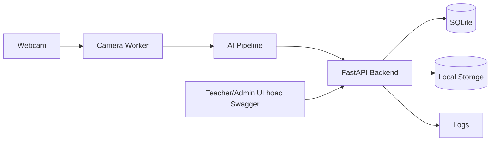

# AttendAI — Hệ thống điểm danh bằng khuôn mặt

Hệ thống điểm danh lớp học local-first với giao diện quản trị chuyên nghiệp, nhận diện khuôn mặt qua webcam, quản lý sinh viên/Face ID, chốt đúng giờ–đi trễ–vắng và xuất báo cáo Excel/CSV.

## Điểm nổi bật của bản demo

- Dashboard vận hành: số sinh viên, độ phủ Face ID, lớp học, phiên đang mở và tỷ lệ tham dự.
- Kiosk điểm danh trực tiếp: camera, hướng dẫn chất lượng, nhận diện liên tục và bảng kết quả realtime.
- Tiếp tục phiên đang mở sau khi tải lại trang, chống ghi trùng bằng idempotency và unique constraint.
- Quản lý hồ sơ, trạng thái đồng ý sinh trắc học, đăng ký từng ảnh hoặc import cả thư mục.
- Đăng ký Face ID đa góc theo năm tư thế: chính diện, trái, phải, lên và xuống.
- Engine mã nguồn mở `ageitgey/face_recognition` + dlib ResNet, lưu năm vector 128 chiều cho mỗi sinh viên.
- Nhận diện realtime bằng khoảng cách Euclidean, lấy mẫu gần nhất theo từng người và kiểm tra margin người thứ hai.
- Chấm đúng giờ/đi trễ theo chính sách từng phiên; tự đánh dấu vắng khi kết thúc.
- Lịch sử phiên, ảnh minh chứng, audit cho cập nhật thủ công và báo cáo Excel/CSV.

> Đây là bản demo học thuật chạy local. Xem `docs/DECISIONS.md` để biết các hạng mục cần nâng cấp trước production.

MVP cho he thong nhan dien khuon mat va diem danh tu dong. Thiet ke uu tien chay local tren Windows, CPU, de debug cho junior.

## Kien Truc


```mermaid
flowchart LR
    Webcam --> CameraWorker[Camera Worker]
    CameraWorker --> AIPipeline[AI Pipeline]
    AIPipeline --> API[FastAPI Backend]
    UI[Teacher/Admin UI hoac Swagger] --> API
    API --> DB[(SQLite)]
    API --> Storage[(Local Storage)]
    API --> Logs[Logs]
```

Trong MVP, chi backend duoc ghi ban ghi diem danh chinh thuc. Camera worker va AI pipeline chi gui su kien nhan dien ung vien.

## Cai Dat Tren Windows

```powershell
python -m venv .venv
.\.venv\Scripts\activate
pip install -r requirements.txt
pip install -r requirements-camera.txt
copy .env.example .env
python scripts/init_db.py
python scripts/seed_demo.py
uvicorn backend.app.main:app --reload
```

### Cài engine Face ID trên Windows

Chạy một lần trong virtualenv. Script dùng wheel `dlib-bin` để tránh phải biên dịch dlib:

```powershell
powershell -ExecutionPolicy Bypass -File scripts\install_faceid.ps1
```

Sau khi cài, vào **Khuôn mặt → Quét Face ID 5 góc**. Quy trình chỉ hoàn tất khi đã thu đủ năm góc nhìn đạt chất lượng. Import thư mục ảnh được giữ cho dữ liệu cũ/tham chiếu, không được xem là đăng ký Face ID hoàn chỉnh.

### Cài engine Face ID trên macOS Apple Silicon

Tạo `.venv` và cài hai bộ dependency như phần cài đặt ở trên, sau đó chạy:

```bash
bash scripts/install_faceid.sh
```

Script cài wheel `dlib-bin` phù hợp với Python 3.13/macOS ARM và model khuôn mặt vào `.venv`. Sau khi cài, khởi động lại backend rồi kiểm tra trang **Khuôn mặt**. `pip check` có thể báo gói `face-recognition` thiếu tên dependency `dlib`: đây là do wheel `dlib-bin` cung cấp module `dlib` dưới tên gói khác; script xác nhận engine bằng cách import và kiểm tra `supports_pose`.

Mo Swagger UI tai:

```text
http://127.0.0.1:8000/docs
```

Mo giao dien quan tri tren trinh duyet tai:

```text
http://127.0.0.1:8000/demo
```

Chay camera worker:

```powershell
pip install -r requirements-camera.txt
python camera_worker/main.py --camera 0 --api http://127.0.0.1:8000 --session-id 1 --class-id 1
```

Neu ban dang dung Python cua MSYS va pip phai build `pydantic-core` hoac OpenCV tu source, hay cai Python chinh thuc tu python.org roi tao lai `.venv`. Backend va test nghiep vu khong phu thuoc OpenCV; OpenCV chi can khi chay camera/AI.

## Test Demo Camera

### Liveness web và camera nghiêng

Web hiện yêu cầu **PAD + thử thách ngẫu nhiên từ server** trước khi ghi điểm danh.
Cài và bật theo [FACE_ANALYSIS.md](docs/FACE_ANALYSIS.md#bật-liveness-web-trên-windows-python-313-x64):

```powershell
python -m pip install -r requirements-liveness.txt
python scripts/download_liveness_models.py
```

Trong `.env`, chọn `LIVENESS_BACKEND=minifasnet`, `LIVENESS_MODE=enforce`,
`LIVENESS_MODEL_DIR=./storage/pad-models/minifasnet-v1`, `WEB_LIVENESS_REQUIRED=true`.
Chỉ cho thử local với trọng số pretrained chưa đánh giá: `LIVENESS_ALLOW_PRETRAINED=true`.
Khởi động lại backend sau khi đổi cấu hình. Trên máy đã tạo `.venv313`, dùng:

```powershell
.\.venv313\Scripts\python.exe -m uvicorn backend.app.main:app --reload
```

Nếu terminal IDE giữ biến môi trường cũ (ví dụ file `.env` là enforce nhưng API
status lại báo off), dùng launcher local đọc lại `.env` hiện tại:

```powershell
.\.venv313\Scripts\python.exe scripts/run_web.py --reload
```

Launcher local ưu tiên `.env` và đặt đúng thư mục dự án. Dừng backend cũ bằng
Ctrl+C trước khi chạy; chỉ mở một backend trên cổng 8000. Quy tắc ưu tiên biến môi
trường khi triển khai trực tiếp bằng Uvicorn vẫn được giữ nguyên.

`PREPROCESSING_MODE=enforce` bật tìm hướng camera/roll, căn mắt và CLAHE. Cần quét
lại đủ 5 góc cho profile mới; mẫu legacy được giữ và không tự trộn. Camera nghiêng
vừa được hỗ trợ, mặt quay quá xa/che khuất vẫn cần người dùng điều chỉnh.

Vào **Điểm danh**, bật camera, bắt đầu quét và quay đầu theo chỉ dẫn rồi trở về
nhìn thẳng. Không dùng ảnh in/video để đăng ký hoặc xác minh. Nếu thiếu model/engine,
UI báo chưa sẵn sàng và không tự ghi điểm danh; quy trình thủ công vẫn dùng được.
Đây là chống giả mạo RGB nhiều lớp; chưa có báo cáo thực địa chứng minh độ chính xác
và không bảo đảm chống mọi video/deepfake/chèn camera ảo. Xem API trong [docs/API.md](docs/API.md).

```powershell
pip install -r requirements-camera.txt
uvicorn backend.app.main:app --reload
```

Sau do mo:

```text
http://127.0.0.1:8000/demo
```

Luot test nhanh:

1. Dang nhap tai `/demo/login` bang `admin / admin123`.
2. Mo trang **Sinh vien** de them, sua va ghi nhan trang thai dong y.
3. Mo trang **Khuon mat** de quet du 5 goc cho sinh vien da dong y. Co the nhap thu muc anh tham chieu; ten file nen bat dau bang MSSV, vi du `SV001.jpg`, `SV001_1.jpg`.
4. Mo trang **Buoi hoc**, chon lop, gio vao hoc va so phut cho phep tre, sau do mo buoi.
5. Trang **Diem danh** cho phep bat camera, quet, xem bang diem danh, dieu chinh thu cong va xuat CSV.

Giao dien gom cac URL rieng: `/demo` (tong quan), `/demo/students`, `/demo/faces`, `/demo/sessions`, `/demo/attendance`.

## Chay App Desktop

Mo terminal 1 de chay backend:

```powershell
.\.venv-win\Scripts\activate
python scripts\init_db.py
python scripts\seed_demo.py
uvicorn backend.app.main:app --reload
```

Mo terminal 2 de chay app:

```powershell
.\.venv-win\Scripts\activate
python desktop_app\main.py
```

Tai khoan demo:

```text
admin / admin123
device01 / device123
```

Luong admin:

1. Dang nhap bang `admin`.
2. Tao yeu cau diem danh gom ten lop, danh sach sinh vien, giang vien, gio vao hoc va gio ket thuc.
3. Import anh khuon mat. Ten file nen bat dau bang MSSV, vi du `SV001.jpg`, `SV001_1.jpg`.

Luong user/device:

1. Dang nhap bang `device01`.
2. Bam `Tai yeu cau` de lay cac yeu cau diem danh dang mo.
3. Chon yeu cau va bam `Bat dau diem danh`.
4. Dua mat vao camera. Khi nhan dien duoc, app hien ho ten, ma sinh vien, lop hoc va thong bao diem danh.

Hien tai desktop app da ho tro diem danh sinh vien. Diem danh giang vien nen lam o buoc tiep theo bang cach tach doi tuong nhan dien thanh `Person`/`PersonFaceTemplates` dung chung cho sinh vien va giang vien, thay vi gan tat ca vao bang `Students`.

Mac dinh demo dung header:

```text
X-User-Id: 1
X-Camera-Token: change-me-camera-token
```

## Thu Nghiem

```powershell
pytest
```

Tiền xử lý ảnh và PAD có chế độ `off/shadow/enforce`. Có baseline HOG/SVM + DFT tự
huấn luyện và ensemble MiniFASNet ONNX tải riêng; web mặc định yêu cầu PAD sẵn sàng
cùng thử thách server. Xem [hướng dẫn tích hợp và đánh giá](docs/FACE_ANALYSIS.md).
Chưa kèm model PAD đã được đánh giá thực địa.
Để chạy cả kiểm thử HTTP mới, cài `pip install -r requirements-dev.txt` rồi chạy `pytest`.

Nếu quay đầu hay báo không thấy mặt, có thể bật detector hỗ trợ YuNet (CPU,
không thay model nhận dạng dlib):

```powershell
python scripts/download_face_detector.py
```

Đặt `FACE_DETECTION_BACKEND=hybrid` và `PREPROCESSING_MODE=enforce` trong `.env`,
rồi khởi động lại bằng `python scripts/run_web.py --reload`. Status
`/face-analysis/status` phải có `face_detection.yunet_ready=true`. Thiếu model
thì quay về HOG và status báo lỗi; không tự tải model lúc nhận request. YuNet
chỉ hỗ trợ tìm mặt, không thay ngưỡng nhận dạng hoặc chống giả mạo. Nhánh HOG
đã nhận mặt vẫn giữ box/profile cũ nên chỉ bật detector không buộc đăng ký lại.
Nếu đổi cấu hình căn mắt/CLAHE/mirror thì vẫn cần đăng ký lại theo profile mới.

Khi quét, quay chậm khoảng 18° trái/phải hoặc 12° lên/xuống theo hướng dẫn,
không quay ngang hẳn. Mất mặt/nhòe thoáng qua không xóa các bước đã hoàn thành;
bước hiện tại phải giữ lại đủ thời gian bằng các frame mới. Mất mặt quá 5 giây,
phát hiện spoof, nhiều người hoặc đổi người thì thử thách vẫn bị hủy.

Kiểm tra lint: `python -m ruff check .` (hoặc `make lint`). Để kiểm tra giao diện
camera bằng Chrome và webcam tổng hợp, không dùng camera thật:

```powershell
python -m pip install -r requirements-browser.txt
python -m pytest -q tests/test_web_ui.py --run-browser
```

`make test` chạy toàn bộ unit/integration và bỏ qua nhóm Chrome khi không có
`--run-browser`; `make test-browser` chạy riêng nhóm này. Chúng không đo độ chính
xác PAD với ảnh in/video thực tế. Dùng `scripts/evaluate_liveness.py` với dữ liệu
tách người như hướng dẫn FACE_ANALYSIS để đánh giá tiếp.

## Luu Y Bao Mat

- Khong log anh khuon mat, embedding hoac token.
- Embedding van la du lieu sinh trac hoc nhay cam, khong xem la vo danh.
- Can co dong y cua sinh vien truoc khi dang ky khuon mat.
- Luon co phuong an diem danh thu cong.
